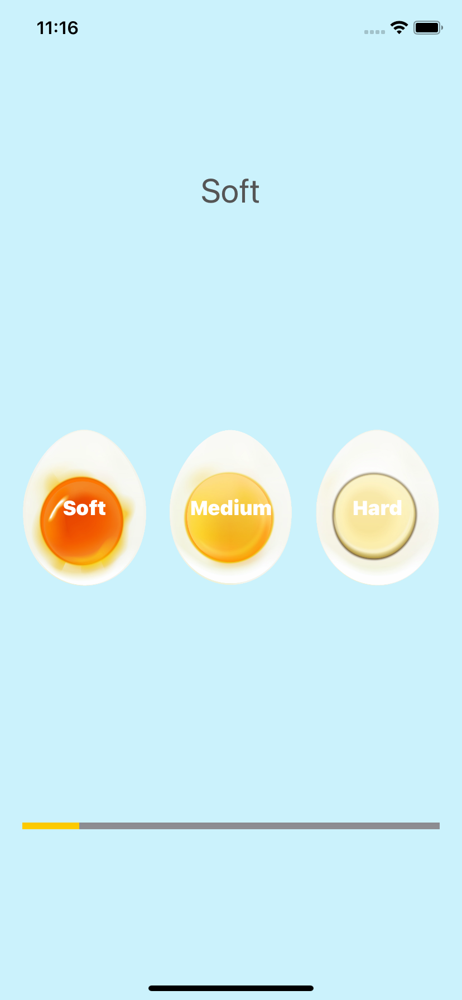

Egg Timer, Developed by Sebastian Güiza, using Xcode and App Brewery

# *** Egg Timer ***

What I learn in this module was:

* Swift Collection types - Dictionaries
* The Swift Timer API
* Conditional statements - IF/ELSE
* Conditional statements - Switch
* Functions with outputs
* How to use the ProgressView

Everybody who wants to use this application, ¡¡¡ Enjoy it !!!

